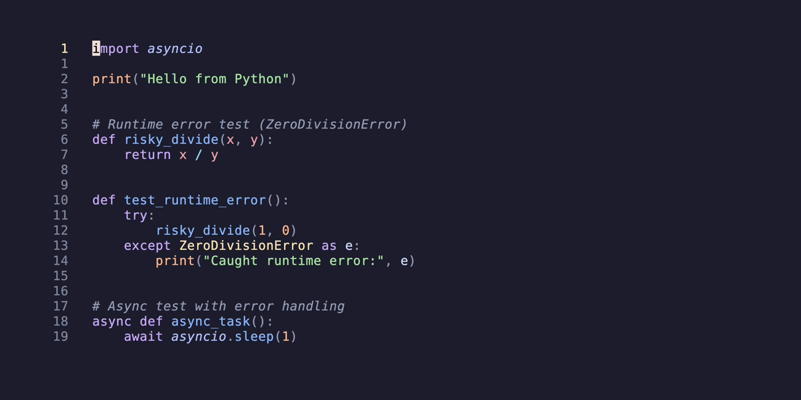
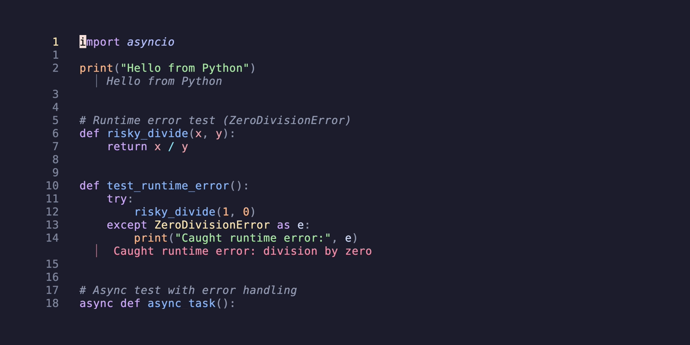
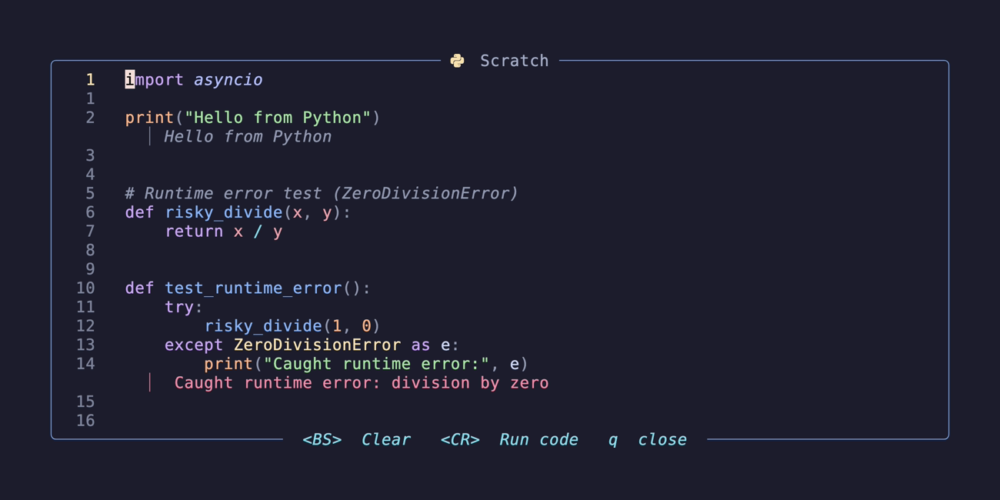

# 🪰 `itchy.nvim`

When you don't _need_ a debugger. Quickly evaluate code and view output as virtual lines.



> [!WARNING]
> This plugin is in early development and may not work as expected.
>
> It relies on hacks to hijack `stdout`and `stderr`through code wrappers.

## ✨ Features

- Quickly evaluate code in a buffer or visual selection
- View stdout and stderr within the buffer as virtual lines
- [`snacks.nvim`](https://github.com/folke/snacks.nvim) integration (optional)

## 💻 Supported languages / runtimes

- Go: `go`
- JavaScript/TypeScript: `bun`, `deno`, `node`
- Python: `python`, `uv`
- Shell scripts: `bash`, `sh`, `zsh`
- Windows scripts: `dosbatch` (very buggy), `pwsh`, `powershell`

## 📦 Installation

[folke/lazy.nvim](https://github.com/folke/lazy.nvim)

```lua
{
    'joncrangle/itchy.nvim',
    event = { 'BufReadPre', 'BufNewFile' },
    ---@type itchy.Opts
    opts = {
        -- your configuration comes here
        -- or leave it empty to use the default settings
        -- refer to the configuration section below
    },
    -- sample keymapping
    keys = {
      { '<leader>td', mode = { 'n', 'v' }, '<cmd>Itchy run<cr>', desc = '[T]est [D]ebug' },
    },
}
```

## 🚀 Usage

- Within a buffer for a supported filetype `:Itchy run`



- If using the `snacks.nvim` integration, run within a scratch buffer with default keymap `<CR>`



### Commands

| Command              | Description                                                       |
|----------------------|-------------------------------------------------------------------|
| `:Itchy run`         | Run `itchy.nvim` in the current buffer                            |
| `:Itchy run runtime` | Run `itchy.nvim` in the current buffer with the specified runtime |
| `:Itchy clear`       | Clear the virtual lines                                           |
| `:Itchy list`        | List available runtimes for the current filetype                  |
| `:Itchy current`     | Display the current runtime for the current filetype              |

Alternatively, you can use `Lua` equivalents:

```lua
--- Run evaluation of a buffer.
--- Shows the output of logs and errors inlined with the code.
---@param rt? string   -- runtime
---@param buf? integer -- buffer, default: current buffer
require('itchy').run(rt, buf)

--- Clear extmarks from the buffer.
---@param buf? integer
require('itchy').clear(buf)

--- Print available runtimes for the current buffer.
---@param cmd? boolean
---@param buf? integer
---@return string[]?
require('itchy').list(cmd, buf)

--- Print current runtime for the current buffer.
---@param buf? integer
require('itchy').current(buf)
```

To get all executable runtimes:

```lua
--- Get all available runtimes.
---@return table<string, itchy.Runtime[]>
require('itchy').get_runtimes()
```

## ⚙️ Configuration

<details>
<summary>Full configuration with default values</summary>

```lua
{
    'joncrangle/itchy.nvim',
    event = { 'BufReadPre', 'BufNewFile' },
    ---@type itchy.Opts
    opts = {
        -- your configuration comes here
        -- or leave it empty to use the default settings

        --- Default runtimes
        ---@type table<string, string>
        defaults = {
            javascript = 'node', -- or 'deno'|'bun'
            typescript = 'deno', -- or 'node'|'bun'
            python = 'python',   -- or 'uv'
            ps1 = 'pwsh',        -- or 'powershell'
        },
        -- add additional / custom runtimes
        -- refer to the configuration section below
        ---@type table<string, itchy.Runtime>
        runtimes = {
            -- Override default runtime configurations or add new ones
            -- See example below
        },
        debug_mode = false,     -- or true
        --- highlight groups to apply to virtual lines
        ---@type table<"stdout"|"stderr", string>
        highlights = {
            stdout = 'Comment',
            stderr = 'Error',
        },
        --- integrations to enable
        ---@type table<string, itchy.Integration[]>
        integrations = {
            -- snacks.nvim scratch buffer integration
            snacks = {
                enabled = true,     -- or false
                keys = {
                    run = '<CR>',   -- Carriage Return (Enter)
                    clear = '<BS>', -- Backspace
                }
            },
        },
    },
}
```

</details>

<details>
<summary>Create a custom runtime</summary>

```lua
---@class itchy.Runtime
---@field cmd string
---@field args string[]
---@field offset integer
---@field wrapper? fun(code: string, offset?: integer): string
---@field temp_file? boolean
---@field env? table<string, string>

-- Example of a custom runtime
opts = {
    runtimes = {
        filetype = {             -- the filetype
            runtime_name = {     -- the name of the custom runtime
                cmd = 'cmd',     -- the command to run
                args = { '/c' }, -- arguments to pass to the command
                -- omit wrapper to use the default filetype wrapper, or:
                wrapper = function(code, offset)
                    -- add custom wrapper code here
                    -- format stdout as LINE{line_number}: {message}
                    -- if possible, format stderr as LINE:{line_number}: ItchyError: {error_message}
                    -- otherwise, format stderr or Error: {error_message}
                    -- return code as a string
                end,
            },
        },
    },
},
```

</details>

> [!NOTE]
> The options are also available in Neovim by calling `:h itchy.nvim`

## 🎉 Acknowledgements

- [`snacks.nvim`](https://github.com/folke/snacks.nvim) for implementing scratch buffers and core functionality for `Lua`
- [jdrupal-dev](https://github.com/jdrupal-dev) for the idea of [creating a wrapper that injects line numbers](https://github.com/folke/snacks.nvim/issues/203#issuecomment-2541372433)
