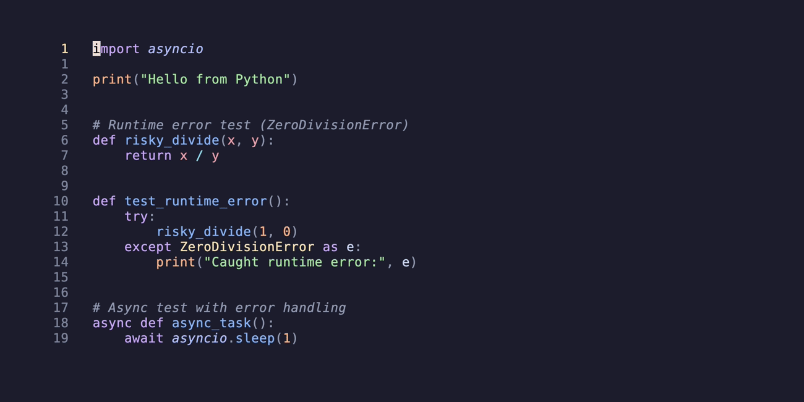
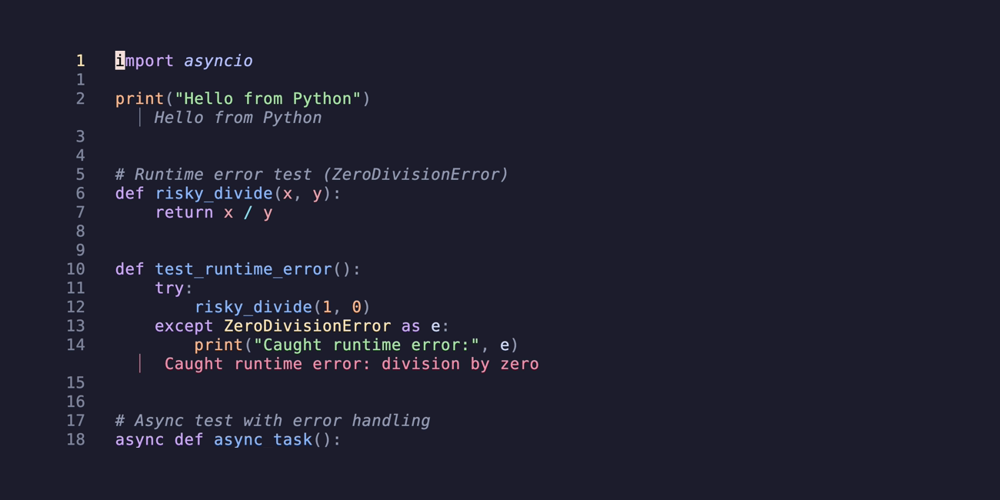
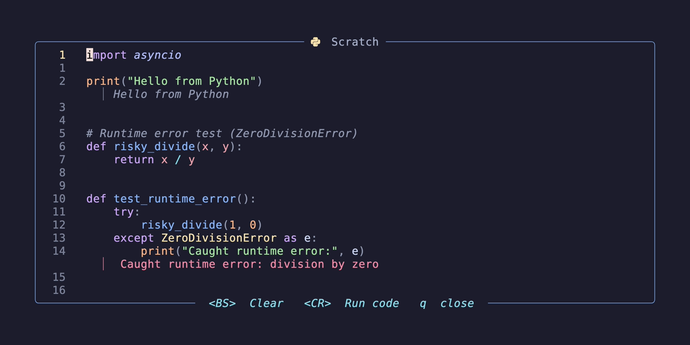

# 🪰 `itchy.nvim`

Run code from a buffer or visual selection and inspect stdout and stderr as inline virtual lines.



## ✨ Features

- Evaluate code from an entire buffer or a visual selection
- Display stdout and stderr inline as virtual lines
- Optional [`snacks.nvim`](https://github.com/folke/snacks.nvim) scratch buffer integration

## 💻 Supported languages / runtimes

- Go: `go`
- JavaScript and TypeScript: `bun`, `deno`, `node`
- Python: `python`, `uv`
- Shell: `bash`, `sh`, `zsh`
- PowerShell: `pwsh`, `powershell`

When nvim-treesitter includes the `go` parser, `itchy.nvim` parses Go syntax trees to target output calls precisely. Strings, comments, and unrelated methods with matching names are ignored. When the parser is missing, an internal scanner performs comment- and string-aware matching instead.

## ⚡ Execution

Subprocesses run through `vim.system()` using argument arrays instead of shell command strings. Arguments with spaces or shell characters pass directly to the process. Environment overrides like Go's `GO111MODULE` apply only to the spawned child process and do not modify Neovim's environment.

Neovim 0.11 and 0.12 use callback-based `vim.system()` jobs. Neovim 0.13 and newer use `vim.async` structured concurrency. Backend selection is automatic.

Each buffer tracks at most one active job. Starting a new run cancels the previous job. Editing, clearing, or deleting the buffer cancels active jobs so outdated results never overwrite current buffer contents.

## 📦 Installation

Using [folke/lazy.nvim](https://github.com/folke/lazy.nvim):

```lua
{
  'joncrangle/itchy.nvim',
  event = { 'BufReadPre', 'BufNewFile' },
  ---@type itchy.Opts
  opts = {
    -- configuration goes here
  },
  keys = {
    { '<leader>td', mode = { 'n', 'v' }, '<cmd>Itchy run<cr>', desc = '[T]est [D]ebug' },
  },
}
```

## 🚀 Usage

In any buffer with a supported filetype, run `:Itchy run`.



Inside a `snacks.nvim` scratch buffer, press `<CR>` to run and `<BS>` to clear.



### Commands

| Command                | Description                                      |
| ---------------------- | ------------------------------------------------ |
| `:Itchy run`           | Run evaluation on the current buffer             |
| `:Itchy run <runtime>` | Run evaluation using the specified runtime       |
| `:Itchy clear`         | Clear virtual lines from the buffer              |
| `:Itchy list`          | List available runtimes for the current filetype |
| `:Itchy current`       | Show the active runtime for the current filetype |

Lua API equivalents:

```lua
--- Run evaluation for a buffer.
---@param rt? string runtime name
---@param buf? integer buffer handle, defaults to current buffer
require('itchy').run(rt, buf)

--- Clear virtual lines from a buffer.
---@param buf? integer buffer handle
require('itchy').clear(buf)

--- List available runtimes for the current buffer.
---@param cmd? boolean print commands instead of names
---@param buf? integer buffer handle
---@return string[]?
require('itchy').list(cmd, buf)

--- Display the active runtime for the current buffer.
---@param buf? integer buffer handle
require('itchy').current(buf)

--- Get all available runtimes by filetype.
---@return table<string, itchy.Runtime[]>
require('itchy').get_runtimes()
```

## ⚙️ Configuration

<details>
<summary>Default options</summary>

```lua
{
  'joncrangle/itchy.nvim',
  event = { 'BufReadPre', 'BufNewFile' },
  ---@type itchy.Opts
  opts = {
    --- Default runtimes per filetype
    ---@type table<string, string>
    defaults = {
      javascript = 'node',
      typescript = 'deno',
      python = 'python',
      ps1 = 'pwsh',
    },
    --- Custom runtime definitions
    ---@type table<string, table<string, itchy.Runtime>>
    runtimes = {},
    debug_mode = false,
    --- Highlight groups for virtual lines
    ---@type table<"stdout"|"stderr"|"warning", string>
    highlights = {
      stdout = 'Comment',
      stderr = 'DiagnosticError',
      warning = 'DiagnosticWarn',
    },
    --- Plugin integrations
    ---@type table<string, itchy.Integration[]>
    integrations = {
      snacks = {
        enabled = true,
        keys = {
          run = '<CR>',
          clear = '<BS>',
        },
      },
    },
  },
}
```

</details>

<details>
<summary>Custom runtimes</summary>

Custom runtimes can reference an existing built-in adapter by name (`'python'`, `'javascript'`, `'go'`, `'bash'`, `'zsh'`, `'sh'`, `'powershell'`) or supply an adapter table implementing `prepare` and `decode`.

```lua
---@class itchy.Runtime
---@field cmd string
---@field args? string[]
---@field adapter string|itchy.RuntimeAdapter
---@field temp_file? boolean
---@field env? table<string, string>

-- Example 1: Custom runtime with a built-in adapter
opts = {
  runtimes = {
    python = {
      my_python = {
        cmd = 'python3.12',
        args = { '-c' },
        adapter = 'python',
      },
    },
  },
}

-- Example 2: Custom runtime with an inline adapter
opts = {
  runtimes = {
    my_lang = {
      runner = {
        cmd = 'my-runner',
        args = { '--run' },
        temp_file = false,
        adapter = {
          name = 'my_runner_adapter',
          --- Prepare the execution payload
          ---@param ctx itchy.AdapterContext
          ---@return itchy.PreparedExecution
          prepare = function(ctx)
            return {
              source = ctx.source,
              -- cmd = { 'my-runner', '--eval', ctx.source },
              -- cleanup = function() ... end,
            }
          end,
          --- Decode the execution result into normalized events
          ---@param ctx itchy.AdapterContext
          ---@param prepared itchy.PreparedExecution
          ---@param result itchy.ExecutionResult
          ---@return itchy.Event[]
          decode = function(ctx, prepared, result)
            local event = require('itchy.event')
            local events = {}
            if result.stdout then
              for line in result.stdout:gmatch('[^\r\n]+') do
                -- Event.line is a 1-based source line, or nil for locationless
                table.insert(events, event.create('stdout', line, 1))
              end
            end
            if result.stderr and result.stderr ~= '' then
              table.insert(events, event.create('error', result.stderr, nil))
            end
            return events
          end,
        },
      },
    },
  },
}
```

</details>

> [!NOTE]
> Detailed help is available in Neovim via `:h itchy.nvim`

## 🎉 Acknowledgements

- [`snacks.nvim`](https://github.com/folke/snacks.nvim) for scratch buffers and Lua evaluation.
- [jdrupal-dev](https://github.com/jdrupal-dev) for the original inspiration behind line-aware inline execution output.
